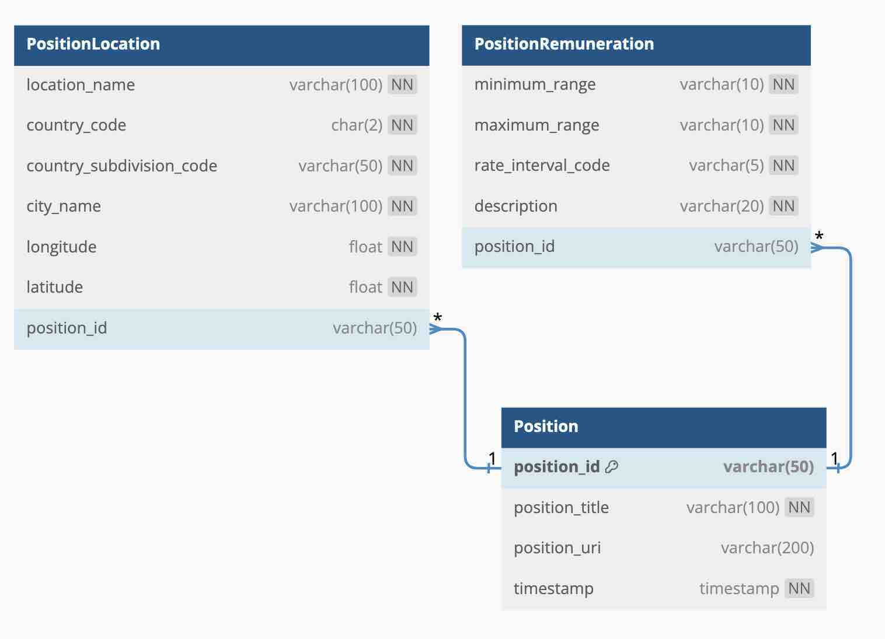

# Data-Engineer-Take-Home-Assignment

## Positions Database Design of Tables and Data Models

**Title table:** 
This is the parent table of Location table and the Remuneration table. It the main table that holds the basic information about each job position.

| Column name | Data type | Description |
|---|---|---|
| PositionID | integer | Primary key of the table |
| position_title | string | The title of the position |
| PositionURI | string | The URI of the position |

**Location table:** 
The Location table is a child table of the Title table and it stores the location information for each position.

| Column name | Data type | Description |
|---|---|---|
| PositionID | integer | Foreign key to Position table |
| LocationName | string | The name of the location |
| CountryCode | string | The country code of the location |
| CountrySubDivisionCode | string | The country subdivision code of the location |
| CityName | string | The city name of the location |
| Longitude | float | The longitude of the location |
| Latitude | float | The latitude of the location |

**Remuneration table:** 
The Remuneration table is also a child table of the Title table and it stores the remuneration information for each position.

| Column name | Data type | Description |
|---|---|---|
| PositionID | integer | Foreign key to Position table |
| MinimumRange | float | The minimum salary range for the position |
| MaximumRange | float | The maximum salary range for the position |
| RateIntervalCode | string | The rate interval code for the salary range |
| Description | string | The description of the salary range |


## DBML for the Tables Relationships
```sql
Table Position {
    position_id          varchar(50)   [primary key]
    position_title       varchar(100)  [not null]
    position_uri         varchar(200)  [unique]
    timestamp            timestamp     [not null]
}

Table PositionLocation {
    location_name            varchar(100)  [not null]
    country_code             char(15)       [not null]
    country_subdivision_code  varchar(50)   [not null]
    city_name                varchar(100)  [not null]
    longitude               float         [not null]
    latitude                float         [not null]

    // References
    position_id          varchar(50)  [ref: > Position.position_id]
}

Table PositionRemuneration {
    minimum_range            varchar(10)   [not null]
    maximum_range            varchar(10)   [not null]
    rate_interval_code        varchar(5)    [not null]
    description             varchar(20)   [not null]

    // References
    position_id          varchar(50)  [ref: > Position.position_id]
}
```

